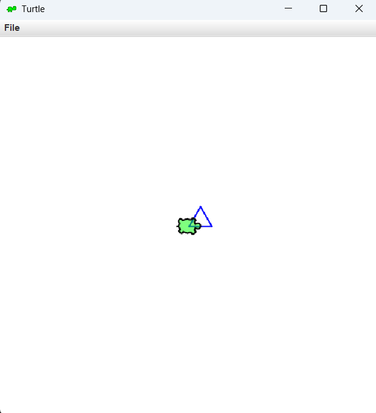

# Assignment8
**CSC 175 Group Project** 

A java project that demonstrates an inheritance hierarchy, using the Turtle class provided in the GitHub repository. The inheritance hierarchy is shown using a base **Shapes** class and four subclasses. 


# Table of Contents

1. <a href="#project-structure">Project Structure</a>
2. <a href="#turtle.java">Turtle.java</a>
3. <a href="#base-class">Base Class</a>
4. <a href="#subclasses">Subclasses</a>
5. <a href="#example-concepts-used">Example Concepts Used</a>
6. <a href="#sample-output">Sample Output</a>
7. <a href="#authors">Authors</a>


# Project Structure

Assignment8  <br>
│  <br>
├── .gitignore  <br>
├── App.java  <br>
├── Circle.java  <br>
├── Pentagon.java  <br>
├── README.md  <br>
├── Rectangle.java  <br>
├── Shape.java  <br>
├── Triangle.java  <br>
├── Turtle.java  <br>
└── turtleOutput.png <br>

# Turtle.java

> This version is a modified version of the class based off of **Nick Seward's** Turtle class (all credit goes to them). 

The documentation of the Turtle classes, used in this project are in the webpage attached the the activity **Turtle Class Documentation - README**. 


# Base Class

| Class | Description |
| ----------- | ----------- |
| Shape | Parent class containing shared shape attributes and methods |


# Subclasses

| Class | Extends | Description |
| ----------- | ----------- | ----------- |
| Rectangle | Shape | Child class representing a standered rectangle |
| Circle | Shape | Child class representing a standered circle |
| Triangle | Shape | Child class representing a standered triangle|
| Pentagon | Shape | Child class representing a standered pentagon |


# Example Concepts Used

## Inheritance

`class Rectangle extends Shape {`

## Methode Overriding

```
 @Override
    public void draw(Turtle t){

        t.penColor(this.getColor());

        for(int i = 0; i < 2; i++){
        t.forward(width);
        t.right(90);
        t.forward(length);
        t.right(90);
        }

    }
```


# Sample Output

## In Terminal
```
Choose one of the options below (the number choice)
1. Draw a Shape
2. Draw a shape at a specific point
0. Exit
1
Choose a shape to draw (the number choice
1. Circle
2. Rectangle
3. Triangle
4. Pentagon
0. Back
3
Enter a length for the Triangle (a double): 30
Enter a color for the Triangle (a string): blue 
```

## In Turtle


# Authors

**Edward Silverman**  <br>
**Thomas Guzzetta**  <br>
**Jorden Campbell**  <br>
**Alyssa Sul**  <br>
